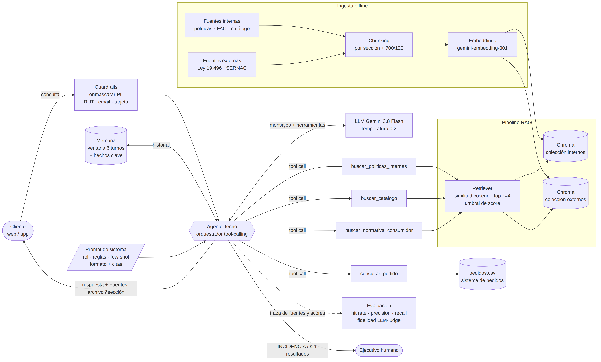

# Tecno — Asistente de atención al cliente con LLM + RAG para TecnoHogar SpA

Proyecto de la Evaluación Parcial N°1 de **ISY0101 Ingeniería de Soluciones con IA** (Duoc UC).
Agente conversacional que responde consultas de clientes de un e-commerce de tecnología y electrodomésticos
(garantías, devoluciones, despachos, pedidos, productos y derechos del consumidor), combinando
**fuentes internas** (políticas, FAQ, catálogo, pedidos) y **fuentes externas** (Ley 19.496 y guías del SERNAC)
mediante un pipeline RAG, con citas de fuente en cada respuesta.



## Stack
| Componente | Tecnología | Motivo |
|---|---|---|
| LLM | Google Gemini 3.8 Flash (`langchain-google-genai`) | Capa gratuita, soporte de tool-calling, baja latencia |
| Embeddings | `gemini-embedding-001` (o `local` para pruebas) | Multilingüe, semántico |
| Vector store | Chroma (persistente, similitud coseno) | Local, sin servidor, filtra por metadatos |
| Orquestación | LangChain Core (tools + `bind_tools`) | Estándar visto en clases |
| Pruebas | pytest (16 pruebas, sin consumo de API) | Reproducibilidad |

## Estructura
```
data/internos/    políticas de garantía y despacho, FAQ, catálogo (CSV), pedidos (CSV)
data/externos/    extracto Ley 19.496 (BCN) y guía SERNAC de compras online
src/config.py     parámetros (modelo, temperatura, chunk_size, overlap, top-k, umbral, memoria)
src/ingest.py     carga → chunking por sección + RecursiveCharacterTextSplitter → embeddings → Chroma
src/retriever.py  búsqueda por similitud con umbral de score y contexto delimitado con fuente
src/prompts.py    prompt de sistema (rol, proceso, restricciones, formato), few-shot y prompt juez
src/tools.py      herramientas del agente: políticas, catálogo, normativa, pedidos + traza de fuentes
src/agent.py      bucle de tool-calling con Gemini, memoria y enmascaramiento de datos personales
src/memory.py     ventana deslizante de 6 turnos + hechos clave (último pedido)
src/guardrails.py enmascarado de RUT, correo, teléfono y tarjeta
src/app.py        chat por consola
eval/             dataset de 18 preguntas, métricas de recuperación y fidelidad, demo de recuperación
tests/            pruebas unitarias y de integración (LLM simulado)
docs/             diagramas (arquitectura, flujo RAG), bocetos y evidencia de pruebas
```

## Instalación
Requiere Python 3.10+.
```bash
git clone <URL_DEL_REPOSITORIO>
cd asistente-retail-rag
python -m venv .venv
source .venv/bin/activate        # Windows: .venv\Scripts\activate
pip install -r requirements.txt
cp .env.example .env             # Windows: copy .env.example .env
```
Edita `.env` y pega tu API key gratuita de Google AI Studio (https://aistudio.google.com/apikey) en `GOOGLE_API_KEY`.

## Ejecución
```bash
# 1. Indexar la base de conocimiento (crea la carpeta vectorstore/)
python -m src.ingest

# 2. Conversar con el agente (--debug muestra herramientas, fuentes y scores)
python -m src.app --debug
```
Ejemplos de consultas:
- `¿Cuál es el estado de mi pedido TH-10245?`
- `Mi lavadora falló a los 3 meses, ¿me pueden devolver el dinero?`
- `¿Cuánto demora un despacho a Punta Arenas y cuánto cuesta devolver algo por arrepentimiento?`
- `Mi pedido TH-10260 no ha llegado` (se deriva a ejecutivo por estado INCIDENCIA)

## Pruebas y evaluación
```bash
pytest -v                                        # 16 pruebas, no consumen API
python -m eval.evaluate --provider local         # métricas de recuperación sin costo
python -m eval.evaluate                          # métricas de recuperación con embeddings Gemini
python -m eval.evaluate --generacion             # fidelidad (LLM-as-judge) y tasa de citas
python -m eval.demo_recuperacion "tu consulta"   # ver fragmentos recuperados y sus scores
```
Los resultados quedan en `eval/resultados/`. Evidencia documentada en [docs/evidencia_pruebas.md](docs/evidencia_pruebas.md).

Sin API key puedes probar todo el pipeline de recuperación con `EMBEDDINGS_PROVIDER=local` en `.env`
(embedding léxico por hashing; no entiende sinónimos, sirve solo para pruebas).

## Parámetros principales (`.env`)
| Variable | Valor | Efecto |
|---|---|---|
| `TEMPERATURE` | 0.2 | Respuestas deterministas, menos alucinación |
| `CHUNK_SIZE` / `CHUNK_OVERLAP` | 700 / 120 | Tamaño del fragmento y solapamiento |
| `TOP_K` | 4 | Fragmentos recuperados por búsqueda |
| `SCORE_THRESHOLD` | 0.55 (gemini) / 0.12 (local) | Fragmentos bajo el umbral no se inyectan al prompt |
| `MAX_TURNOS_MEMORIA` | 6 | Turnos conservados en el contexto |

## Limitaciones conocidas
- Los datos internos son simulados (empresa ficticia); el extracto legal es un resumen de apoyo, no el texto oficial.
- El umbral de score depende del modelo de embeddings y debe calibrarse con `eval.evaluate --umbral`.
- La capa gratuita de Gemini tiene límites de solicitudes por minuto y por día (errores 503/429); el agente reintenta automáticamente y el chat no se cierra ante un error.

## Uso de IA en el proyecto
Se utilizó Claude (Anthropic) como apoyo para generar código base, datos simulados y diagramas. Todo fue revisado,
probado y ajustado por el equipo. Ver declaración en el informe.
